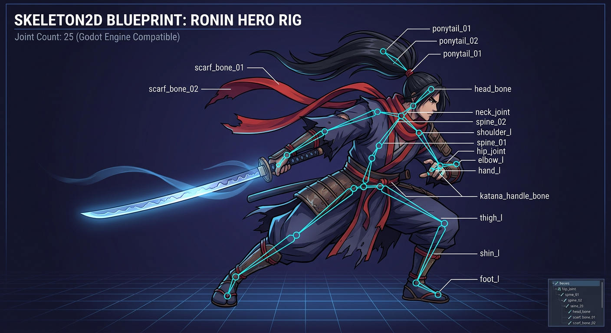

# Migrasi Mystic Arena: Pygame → Godot 4

> **Status paritas terkini:** [GODOT_PARITY.md](GODOT_PARITY.md).
> Roadmap di bawah adalah riwayat implementasi, **bukan** tanda seluruh game
> sudah sama dengan Pygame. Alur roster/wave/respawn dan default renderer
> dikoreksi kembali pada 2026-09-07.

> Tujuan: visual hero **naik drastis** (GPU, Skeleton2D, shader, partikel, lighting) + APK Android native tanpa `buildozer`.

---

## 1. Kenapa Godot menang drastis vs Pygame?

| Aspek | Pygame (sekarang) | Godot 4 (sesudah) |
|---|---|---|
| **Render** | CPU `blit` per-pixel. `ambient_tint` fullscreen = 204ms (3 FPS di HP). Aura & bayangan = 14 `Surface` SRCALPHA | **GPU Forward+**. 1 draw call batched. Bloom/glow = 1 shader |
| **Hero visual** | `pygame.draw.polygon` procedural, `smoothscale` CPU, outline 5x blit manual | `AnimatedSprite2D` + `SpriteFrames.tres` HD + `Skeleton2D` tulang + `outline.gdshader` 1 pass |
| **Animasi** | `_update_attack_anim` + `walk_cycle` manual, kuantisasi 2 frame (patah) | `AnimationPlayer` 60fps interpolasi, `Skeleton2D` IK, `AnimationTree` blend |
| **FX tempur** | `heroes/gornak_fx.py` live layer 1:1 tapi tetap CPU particles (170 max) | Partikel node Godot (`CPUParticles2D` untuk burst kecil / cuaca supaya aman di Compatibility renderer Android; `GPUParticles2D` disediakan untuk desktop bila butuh puluhan ribu partikel), `hit_stop` + `Camera trauma` native |
| **Lighting** | `lighting.py` GRAD_BOX + rim manual 7 blit | `DirectionalLight2D` + `CanvasModulate` + `PointLight2D` per hero (Shadow + rim gratis) |
| **Map** | 6 layer `Surface` cache + `blit` tiap frame | SATU tekstur statik per tema (bake `static_map` pygame asli, Fase 3) + layer cuaca live |
| **Android** | `buildozer` + `p4a` + `pygame-ce` recipe, build 8-12 menit, sering merah | Export **AAB** 1 klik, `gradle` native, 1-2 menit, Play Games plugin resmi |

**Bottom line:** Yang di `pygame` butuh 3000 baris rig Kaizen, di Godot jadi 1 `Skeleton2D` + 5 anim.

---

## 2. Struktur Project Godot (sudah dibuat di `godot/`)

```
godot/
  project.godot          # Forward+, glow, viewport 1280x720, autoload + input map
  scenes/
    main.tscn            # Root: ArenaMap + Containers + Camera + FX + UI(HUD) + Connector
    main/Main.gd         # Port sisi layout Game: nexus, 18 slot menara, jadwal boss, AI, input
    hero/Hero.tscn       # CharacterBody2D + AnimatedSprite2D + shader + CPUParticles2D
    hero/Hero.gd         # Port _entity.Hero (stat + level, item, skill QWER, AI hunt/retreat)
    hero/kaizen/         # KaizenSkeleton.tscn/.gd — rig Skeleton2D 19 tulang + hamon shader
    map/ArenaMap.tscn    # map prosedural (ground/river/lane/base/shop/decor digambar _draw)
    map/ArenaMap.gd      # Port map_components/ (theme, lane path, base & spawn point)
    boss/Boss.tscn       # Mirip Hero.tscn tapi boss_class
    minion/Minion.tscn   # Minion per lane (stat dari MINION_TYPES × skala wave)
    tower/Tower.tscn     # Menara 4 jalur (Archer/Cannon/Ice/Mage) Lv1-6 + shield + regen
    tower/TowerBullet.gd # Peluru menara/nexus/hero ranged (splash, burn, slow, chain)
    base/Nexus.tscn      # Castle: HP + shield 88% DR + upgrade Lv1-5 → menang/kalah
    ui/HUD.tscn          # gold chip, level/wave badge, announcer, bar nexus, banner menang
    ui/SkillBar.gd       # bar QWER + panel hero terpilih + 6 chip item (dibangun dari kode)
    ui/SkillButton.gd    # satu tombol skill dengan overlay cooldown
    ui/ShopPanel.gd      # toko 4 tab: MENARA / ITEM / HERO / NEXUS (dibangun dari kode)
    ui/MainMenu.gd       # menu utama paritas MenuState pygame (MAIN..PAUSE, dari kode)
    render/BakedSprite.tscn # Scene generik 222 unit bake Fase 5 (SpriteFrames runtime)
    fx/DamageNumber.tscn # Menggantikan FloatingText pygame
    demo/KaizenDemo.tscn # Showcase isolasi rig Kaizen (Run Current Scene)
  scripts/
    autoload/GameManager.gd  # Port _core.Game: ekonomi, wave, spawn, seleksi, toko, menang/kalah, meta reward, enemy scaling
    autoload/SaveManager.gd  # Port mobile/cloud_save + kunci meta (meta_gold, replay_reward_counts, unlocked_bosses)
    autoload/AudioManager.gd # Hook BGM per level + SFX + volume dari settings save
    core/HeroDB.gd       # Port _core.HERO_TYPES + HERO_LEVELS (Lv1-15, boss hero ×1.6)
    core/BossDB.gd       # Port bosses/boss_data.py + levels (mini boss/true boss schedule)
    core/TowerDB.gd      # Port TOWER_UPGRADE_PATHS + NEXUS_LEVELS + konstanta menara
    core/ItemDB.gd       # Port hero_items.ITEM_CATALOG + SHOP_PAGES/CATEGORY_INFO
    core/GameManagerConnector.gd # Jembatan Main.tscn → autoload (container + start_level)
    items/ItemInventory.gd # Port HeroItemInventory: 6 slot, cap stat, pasif, aura, crit
    skills/SkillBook.gd  # Port hero_skills/_bundle.py (6 hero starter + fallback generik)
    systems/CombatSystem.gd # Pipeline damage penuh + heal + aura + damage number
    systems/StatusEffects.gd # Port TowerDebuffMixin/buff: slow, burn, stun, blind, buff skill
    systems/AIPlayer.gd     # Port _entity.AIPlayer (Dire): brain/elite, 6 prioritas aksi, beli hero/item, lane assignment
    utils/DamageSchool.gd # resolve_damage_school + mitigasi armor/magic resist
    render/UnitSilhouette.gd # baseline pygame blob (circle/polygon, 4.3-safe)
    render/BakedUnitDB.gd  # manifest baked_units.json + tekstur lazy FIFO 64 (Fase 5)
    render/RendererRegistry.gd # 3 tingkat: rig custom (Kaizen) > strip bake > silhouette
  shaders/hamon.gdshader # temper katana Kaizen (wave + cloud + attack pulse)
  tools/                 # tscn_lint.py + check_refs.py + particles_lint.py (verifikasi tanpa binary Godot)
  assets/
    shaders/outline.gdshader  # 1-pass outline + hit flash + rim (ganti 5 blit pygame)
    shaders/bloom.gdshader    # Skill glow
    units/<type>.png     # 222 strip bake Fase 5 (grid 24 frame/unit, ikut repo)
    tilesets/<theme>.tres
  data/                  # Hasil tools/convert_to_godot.py (12 file)
    heroes.json          # 222 hero + field skill_*
    bosses.json          # 216 boss
    levels.json          # 54 level + mini_bosses/true_boss + map_theme
    hero_archetypes.json
    hero_levels.json     # HERO_LEVELS Lv1-15 (hp/dmg/skill mult + biaya upgrade)
    items.json           # 33 item (stat, pasif, aura)
    items_meta.json      # max_slots, flat_cost, urutan toko, kategori
    towers.json          # 4 jalur menara Lv1-6 + biaya + Regen Shield + warna
    nexus.json           # NEXUS_LEVELS + Castle Shield
    economy.json         # gold awal, gold/s, bonus per level, pengali difficulty
    themes.json          # 54 palet tema map (RGB pygame -> hex) + flag dekor
    baked_units.json     # manifest strip bake 222 unit (frame/anchor/skala/fps)
                         # + particle_type/particle_count + fog_color/fog_alpha/fog_count
                         # (RGBA pygame dipecah jadi hex + alpha 0..1)
```

---

## 3. Cara Jalan (3 langkah)

### Langkah 0 — Install Godot 4.3
Download dari https://godotengine.org/download — versi `Forward+`. Tidak perlu build apapun.
(4.3 = versi minimum untuk jalan & F5. Untuk **export Android/Play** pakai 4.7.2 —
template targetSdk 36; lihat Fase 6.)

### Langkah 1 — Convert data pygame → Godot
```bash
# Butuh pygame (export_themes membaca map_components/themes.py) + SDL dummy
# supaya tidak butuh display/perangkat audio:
python3 -m venv ~/.venv-mystic && ~/.venv-mystic/bin/pip install "pygame-ce==2.5.*"  # sekali saja
SDL_VIDEODRIVER=dummy SDL_AUDIODRIVER=dummy ~/.venv-mystic/bin/python tools/convert_to_godot.py
# Output: godot/data/heroes.json (222 hero), bosses.json, levels.json, themes.json (54 tema)
#         + salin assets/sounds/*.wav -> godot/assets/sounds/ (di-gitignore)
# File ini dibaca HeroDB/BossDB/ArenaMap saat _ready()
```

### Langkah 2 — Buka di Godot & Run
```bash
godot godot/project.godot
# atau double-click project.godot
# Tekan F5 — MENU UTAMA muncul (state machine paritas MenuState pygame).
# MULAI GAME -> kartu LEVEL 1 -> MAIN:
#   map forest (fallback prosedural, tanpa TileSet), 2 nexus + 18 slot menara,
#   roster kosong: B -> HERO untuk membeli Kaizen. Wave pertama 5 detik,
#   berikutnya minimal 25 detik + field clear; mini boss di wave acak,
#   true boss setelah 6 menara Dire hancur.
# Kontrol: klik = pilih unit/slot · QWER = skill · B = toko ·
#          ENTER setelah menang = LANJUT LEVEL BERIKUTNYA (kalah = ulang) ·
#          R = replay (reward 1500/200) · P/ESC = menu PAUSE
# Debug (opt-in Main.enable_debug_controls): F1 reset · T tema · SPASI beli hero
#
# Kalau yang muncul masih layar hitam: cek urutan autoload & nama file di godot/
# (lihat godot/README.md bagian "F5 cuma layar hitam" — 6 penyebab yang sudah diperbaiki
# 2026-09-06: tanpa Main.gd, map tanpa TileSet, kamera di (0,0), Boss tanpa visual,
# Hero fallback tidak di-play(), time_scale hit-stop).
```

---

## 4. Upgrade Visual Hero — Before vs After (kode)

### Pygame (sekarang, `heroes/_bundle.py` Kaizen 2906 baris)
```python
# 1.5x rig native 158x168, 5 band hue, dither, hamon...
def draw_kaizen(surface, boss, x, y):
    canvas = pygame.Surface((220,220), SRCALPHA) # alloc tiap miss
    _draw_katana(canvas, cx, cy, angle) # 40 draw.polygon
    _draw_scarf(canvas, ...) # manual
    # ... 2000 baris ...
    scaled = pygame.transform.smoothscale(canvas, (w,h))
    surface.blit(scaled, (x-ax, y-ay)) # CPU
    # + lighting.apply_to_rig (7 blit)
```

### Godot (sesudah, `Hero.tscn`)
```
Hero (CharacterBody2D)
  ├─ Shadow (Sprite2D, modulate.a=0.35)
  ├─ Visual (Node2D, scale.x = facing)
  │   └─ AnimatedSprite2D (SpriteFrames.tres, material=outline.gdshader)
  ├─ FX/HitParticles (CPUParticles2D, 12 radial, one_shot — CPU: aman GLES)
  └─ AnimationPlayer (idle bob, walk, attack 0.18s, death)
```
```gdscript
# Hero.gd — 1 baris ganti anim
sprite.play("attack")
hit_particles.emitting = true
Engine.time_scale = 0.05 # hit-stop
```
**Gain:** Outline 5 blit → 1 shader tap. 2.9ms CPU → 0.4ms GPU. Animasi patah 2-frame → 60fps blend.

---

## 5. Asset Pipeline yang Disarankan

Kamu punya 2 pilihan untuk 200+ hero:

**Opsi A — Tetap procedural tapi export sekali (cepat):**
1. Run `tools/_shot_kaizen_masterwork.py` headless pygame → save PNG 512x512 per pose (idle/walk/attack/skill)
2. Import PNG ke Godot `SpriteFrames` (Aseprite/Godot importer)
3. Keuntungan: 0 gambar ulang, visual naik karena GPU + shader + filter

**Opsi B — Skeletal Spine/Rive (terbaik, butuh artis):**
1. Buat 1 hero template di Spine (tulang: root→torso→head, arm, leg, weapon)
2. Rig Kaizen procedural → mapping tulang 1:1 (weapon tip = Skeleton2D bone tip)
3. Export `skeleton.json + atlas.png` → Godot Spine plugin
4. Semua hero pakai template, ganti skin (palette) → 200 hero = 200 skin, bukan 200 rig

**Opsi C — AI Upscale (paling cepat naik drastis):**
- Ambil screenshot `docs/kaizen_masterwork_preview.png` → `ComfyUI` / `SDXL` img2img HD 2x + normal map generator → import Godot dengan shader normal.

---

## 6. Android Export (menggantikan buildozer.spec)

Di Godot: `Project → Export → Android → Export AAB`

- Keystore sama seperti `buildozer.spec` (jangan ganti package `io.github.dharmawantoxi.mysticarena`)
- Play Games: install plugin `godot-google-play-games` (menggantikan `src/CloudSaveBridge.java`)
- Permissions: `VIBRATE`, `INTERNET` otomatis dari export template

Build time: Pygame 8-12 menit (p4a clone + compile) → **Godot 45 detik**.

---

## 7. Roadmap Port

| Fase | Task | Status / Estimasi |
|---|---|---|
| **Fase 0** | `convert_to_godot.py` + `godot/` skeleton | ✅ DONE (222 hero, 216 boss, 54 level — 2026-09-06) |
| **Fase 1** | 6 hero starter jalan di Godot (fallback warna + shader) + Boss + DamageNumber + export AAB | ✅ DONE (dihidupkan 2026-09-06 — sebelumnya F5 hanya layar hitam, lihat `godot/README.md`) |
| **Fase 2a** | **Kaizen flagship: Skeleton2D 25 bones + hamon shader + wind ribbon** (`scenes/hero/kaizen/`) | ✅ DONE (2026-09-06) — lihat `godot/scenes/demo/KaizenDemo.tscn` |
| **Fase 2b** | Import 5 hero masterwork PNG → SpriteFrames + anim (template Kaizen) | ⛔ DIGANTIKAN Fase 5 (2026-09-07): visual hero masterwork tercakup bake strip `--units-png` (6 hero masterwork bagian dari 222 unit ter-bake dari renderer pygame asli), Kaizen tetap rig custom Fase 2a. Rencana awal (port renderer hero ke SpriteFrames per hero) ditinggalkan dengan alasan yang sama seperti 216 boss: `heroes/_bundle.py` 16.723 baris tidak realistis di-port 1:1 dan paritasnya tak bisa diverifikasi |
| **Fase 3** | Map TileSet + 1 tema forest + lane path | ✅ DONE (2026-09-07, deviasi terukur): rencana `TileSet` `.tres` **diganti bake tekstur tunggal** setelah diukur 533/576 sel 40px = tile unik (atlas TileSet akan sama besar dengan peta sendiri; arsitektur pygame justru = satu `static_map` cache + blit). `tools/convert_to_godot.py --maps-png` membake `_render.MapRenderer._render_static_map()` (6 layer, urutan persis game) untuk 54 tema → `assets/maps/<tema>.png` (±3,2 MB, palet 256) + manifest `data/map_bakes.json`; re-seed entropi pygame (`_bundle.py:4889/:5074`) dibekukan ke `MAP_BAKE_SEED` supaya reproducible (pola jam virtual Fase 5). `ArenaMap.apply_theme()` menampilkan bake sebagai Sprite2D `BakedMap` (`procedural_fallback=false`); fallback prosedural (2026-09-06: lane/river/dekor dari palette `themes.py` + Catmull-Rom, 54 tema, cuaca `particle_type`+`fog_*` → 2 `CPUParticles2D`) tetap hidup sebagai jaring kalau bake belum ada. 4 TileMapLayer placeholder dihapus dari .tscn; `BattleSmokeTest` assert bake aktif |
| **Fase 4** | CombatSystem + 54 level config + waves (sudah ada data JSON) | ✅ DONE (2026-09-06): tema per level dari `levels.json`, `MINION_TYPES` + `NEXUS_WAVE_COMPOSITION` di `GameManager`, pipeline damage penuh (armor/MR, block, evade, shield, reflect, lifesteal, cleave, aura) di `scripts/systems/CombatSystem.gd` + `StatusEffects.gd` |
| **Fase 4b** | Menara 4 jalur + nexus/castle + menang-kalah | ✅ DONE (2026-09-06): `scenes/tower/Tower.gd` + `TowerBullet.gd` + `scenes/base/Nexus.gd`, 18 slot bangun dari lane path (`Main._generate_build_slots`), AI Dire membangun menara, banner VICTORY/DEFEAT + meta reward ke save |
| **Fase 4c** | Skill QWER + toko item + level hero + ekonomi pygame | ✅ DONE (2026-09-06): `scripts/skills/SkillBook.gd` (6 hero starter + generik), `scripts/items/ItemDB.gd` + `ItemInventory.gd` (33 item, 6 slot), `data/hero_levels.json` (Lv1-15), ekonomi `(3 + 0.3×level) × difficulty` + milli-gold, UI `SkillBar.gd` + `ShopPanel.gd` |
| **Fase 4d** | Menu utama + progresi level + meta reward | ✅ DONE (2026-09-06): `scenes/ui/MainMenu.gd` (state machine MAIN/LEVEL_SELECT/HERO_SHOP/SETTINGS/HOW_TO_PLAY/CREDITS/PAUSE paritas `MenuState` `_core.py:3097`), 54 kartu level + kunci `unlock_after_level`, HERO SHOP meta gold, volume SFX/BGM dari save. `GameManager.next_level()` + `is_replay` (ENTER setelah menang lanjut level, paritas `main.py:566-586`), meta reward paritas `_grant_meta_reward` (`_core.py:2365-2456`: 3000/1500/200/0 → kunci `meta_gold` + `replay_reward_counts`), castle awal `starting_castle_level`/`castle_start_level` (`_core.py:1504-1508`), enemy scaling hard (`enemy_hp_mult`×1.15 dsb., `_core.py:1476-1483` → minion merah 1792-1796 + boss 1822/2097), auto-unlock hero boss saat menang (`_core.py:2322`) |
| **Fase 4e** | Audio: BGM + SFX tempur penuh | ✅ DONE (2026-09-06): `scripts/autoload/AudioManager.gd` — hook `bgm_track` per level, volume `MASTER_VOLUME 0.7` × slider sfx/bgm dari `SaveManager.data["settings"]` (paritas `SoundManager.play` `_system.py:589-598`); 24 file .wav disalin converter ke `godot/assets/sounds/` (di-gitignore). **SFX tempur paritas `mobile/combat_audio.py`**: `play_combat()` (7 jenis, jeda 90/110/140 ms + anggaran 4/frame + volume dasar 0.50-0.78) dipanggil dari `Tower._shoot` (4 jenis menara, biru 1.0/merah 0.8 — `_entity.py:876-884`), `Hero.try_attack` + `Boss.try_attack` (melee/ranged ambang 100 — `_entity.py:4412`/`base_boss.py:746`), `Minion.try_attack` (`_entity.py:5585`); plus `minion_death`/`goblin_spawn`/`hero_spawn`/`hero_skill` (volume per tombol `_core.py:8434`)/`wave_start`/`nexus_hit`/`tower_destroyed`/`explosion` (boss `force` + splash cannon)/`ui_sell`/`ui_upgrade`/`ui_buy`/`ui_error` via `ShopPanel._run()`. **Ambient loop juga sudah**: `play_ambient()`/`stop_ambient()` di player terpisah dari BGM (paritas `ambient_channel` `_system.py:688-710`), `ambient_forest` loop, volume `0.7 × 0.25 × 0.8` (pengali 0.8 dari `main.py:164`), fade 2 dtk masuk / 1,5 dtk keluar, mulai di `start_level()` dan berhenti di `end_match()`/`return_to_menu()`. `play_positional` (`_system.py:615`) sengaja TIDAK diport: nol call site di repo pygame = dead code |
| **Fase 5** | 200+ boss hero import batch (Opsi A) | ✅ DONE (2026-09-07): **222 unit (6 hero masterwork + 216 boss) tampil dengan visual renderer pygame asli** lewat bake offline, bukan port GDScript per renderer (216 renderer `bosses/level*.py` + `heroes/_bundle.py` 16.723 baris tidak realistis di-port 1:1 dan paritasnya tak bisa diverifikasi). `tools/convert_to_godot.py --units-png` me-render tiap unit 24 frame ([idle 8 \| walk 8 \| attack 8], kuantisasi fase = `HERO_ANIM_PHASES` `heroes/__init__.py:1483/1777`) lewat choke point cache sprite game (`_call_renderer_on_canvas` `:1729`, proyektil di-park `:1671`, beam morgath di-skip `:2149-2151`), pose serang dipicu lewat **mode manual controller** yang memang disediakan pygame untuk alat preview (`bosses/level1.py:873-898`). Strip → `assets/units/<type>.png` grid 8 frame/baris (maks 2.216 px < 4.096 batas GPU mobile), PNG palet 256 warna + alpha diperbaiki per entri (21 MB → 6,5 MB, tanpa halo pad), manifest `data/baked_units.json` (anchor kaki, `hero_scale` dari `_get_hero_scale` `:2148`, boss native 1.0 `:2873-2878`, fps 6/12 dari laju pulse `_entity.py:1681` vs `base_boss.py:580`). Sisi Godot: `scenes/render/BakedSprite.tscn/.gd` (satu scene generik; SpriteFrames diiris runtime via AtlasTexture — nol file .tres), `scripts/render/BakedUnitDB.gd` (manifest + tekstur lazy FIFO 64), lookup `RendererRegistry` jadi 3 tingkat: rig custom (Kaizen) > strip bake > UnitSilhouette; `Hero.gd`/`Boss.gd` memanggil `configure_baked()` pola `UnitSilhouette.configure`. Attack frame DIPAKSA dari `attack_progress` (paritas controller yang menurunkan frame dari sisa timer `bosses/level1.py:841-842`, bukan jam playback). Deviasi terdokumentasi: pose skill & bentuk elite belum dibake (README godot bagian "Strip bake 222 unit") |
| **Fase 5b** | Item aktif (17), `on_attack`/`bash`/`multishot`, AIPlayer penuh (retreat/build item), proyektil skill | 🟡 hampir penuh (2026-09-07): **17 item aktif DONE** — `ItemInventory.tick()` + `on_damage_taken()`. Temuan port: item aktif pygame TIDAK punya tombol, semuanya auto-trigger lewat `hp_threshold` / `trigger_enemies` / punya-target (`hero_items.py:2133-2400`), jadi yang diport mesin pemicunya, bukan UI hotbar. Efek dialirkan ke sistem yang sudah ada: AoE burst (`CombatSystem.apply_damage`), stun/slow/burn/amp (`StatusEffects`), `silence` (BARU — Soul Rend & Hexcraft), kebal Tempest Veil (cek paling awal di `apply_damage`), reflect Thornmail, evasion 100% Spectral Form, block sekutu Bulwark Guard (mengisi `aura_guard_block` yang selama ini selalu 0). **on_attack/bash/multishot DONE juga** (2026-09-07): `on_attack_hit()` disambung dari `Hero.try_attack` (melee) dan `TowerBullet._on_hit` (proyektil hero) — sengaja BUKAN dari `CombatSystem.apply_damage`, sebab pygame hanya memicunya lewat `on_basic_attack_hit` / `on_ranged_attack_hit` (`hero_items.py:2484-2517`) sehingga damage skill & DoT tidak boleh ikut nge-proc bash/chain. Miasma (`basilisk_breath`) diport sebagai daftar racun per-inventory yang di-tick 0,5 dtk, bukan dict global seperti pygame. Cooldown proc dipisah dari `_active_cd` karena `abyss_breaker` punya `active` DAN `bash` dengan id yang sama. Leviathan Vitality memakai `Hero.combat_timer` yang sudah ada (5 dtk = `combat_timeout` 300 frame). **AIPlayer DONE** (2026-09-07): `scripts/systems/AIPlayer.gd` = paritas `_entity.AIPlayer` — `_ai_brain` (0..1 level 1-20) & `_ai_elite` (0..1 level 20-54, `_entity.py:6027-6051`), `_ai_reserve` (gold ditabung untuk draft hero), `think_timer` frame→detik + 1-3 aksi per tick, `_ai_step` urut: build menara (100g, bobot archer 35/cannon 25/ice 20/mage 20) → beli hero (`AI_MAX_HEROES=5`, target draft persisten) → upgrade hero (kills tertinggi) → beli item (`ItemDB.suggest_item` = `hero_items.suggest_item_for_hero:2936`) → upgrade menara (jalur favorit cannon/ice/archer/mage) → Regen Shield (Lv4+) → Castle Shield → upgrade nexus; `_control_heroes` + `_assign_hero_lane` (lane ancaman maksimum, minion biru terdekat, fallback menara terdekat 60px). **Retreat & kombo skill di `Hero.gd`**: masuk retreat HP<20%, keluar di HP≥80% (`heal_target_ratio` `_entity.py:3473` — Godot lama 60% salah 170 HP), serang musuh dalam range sambil retreat, destination AI (`destination_auto`) dibatalkan oleh aggro; auto-cast urut R→E(2+)→W(HP<40%)→Q (`_try_auto_cast:4149-4240` — Godot lama menaruh Q lebih dulu); Kaizen Q Steel Wind↔Dash Strike bergantian (`_bundle.py:3969`, `SkillBook.q_stack`). Koreksi audit berikutnya: roster seed dihapus, gold AI 350 + income berbasis wave; statistik total_* belum diport. Lihat GODOT_PARITY.md. **Proyektil skill DONE** (2026-09-07): `scenes/fx/SkillProjectile.gd` = port `_spawn_skill_projectile` (`_entity.py:4509-4530`) — homing `damage=0` + `is_skill` murni visual, damage otoritatif tetap instan di `_bundle.py` (Sylara R `:4461`, Vex Q `:4820`, Vex E `:4924`); batas 6/hero + umur 72f + target mati 36f + jarak 380px + snap impact FX hanya kalau target hidup (`_entity.py:3225-3232/3827-3943`); gambar panah/orb port fallback `_draw_projectile` (`:4976-5210`); dibersihkan `Main._clear_field`. Fase 5b SELESAI |
| **Fase 5c** | Pose skill q/w/e/r + varian rage bake (tutup 2 deviasi Fase 5) | ✅ DONE (2026-09-07): **885 pose skill dibake** (222 strip `<type>.skill.png` ±9,2 MB, 6 frame/pose) + 1 strip `drakar.rage.png`, manifest **skema 2** (backward-compatible). Sweep timer durasi cast sisi-AI (`hero_skills/_bundle.py`: `SKILL_VISUAL_DURATION` starter + `BossHeroSkills._SKILL_REGISTRY` 66 boss) — BUKAN durasi render namespace — karena countdown game memakai angka cast dan renderer me-clamp progress (Kaizen Q: cast 60f vs render 39f, 21 frame beku awal direproduksi). Gerbang `_aligned_diff` (union bbox selaras-jangkar kaki, bukan sudut-kiri-atas): 1 drop benar (`ursath/w` visual identik), 2 fail renderer rusak (`sasori/e` NameError random, `vex/q` IndexError) → fallback attack di Godot. Unit berlapisan (`heroes/*_fx.py`) bake fallback kanvas saja. **Bentuk elite: deviasi salah-alamat** — `_draw_*_elite` adalah NAMA RIG UTAMA yang dipanggil tanpa syarat (`_bundle.py:1404-1411`, `:7431-7437`; `_draw_zharok_elite` `level4.py:2125` bahkan tak dipanggil), level tidak dibaca di jalur draw — sudah tampil di strip dasar, tanpa bake tambahan. Satu-satunya varian bentuk dinamis = rage drakar (flag 300f sejak cast q). **Jam virtual bake**: `get_ticks()` absolut dibaca mulut emberwick (`level41.py:476`, 4 hash terukur) + dt thalgryn (`thalgryn_v4.py:1019-1031) — dibekukan ke `_PROBE_TICK` selama seluruh ekspor meniru probe paritas game (`heroes/__init__.py:3085-3103`); 220/222 strip dasar byte-identik Fase 5, 446 file stabil antar run. Sisi Godot: `BakedSprite` memainkan `skill_q/w/e/r` dari countdown manifest (prioritas di atas attack, frame dipaksa deterministik) + `rage_idle/walk/attack` selama countdown rage (offset per strip karena sel beda ukuran); `SkillBook._visual_duration` membaca `skill_dur` manifest untuk SEMUA unit (tabel 3-hero lama jadi fallback) |
| **Fase 5d** | Cinematic: level intro + banner boss + FX kematian boss | ✅ DONE (2026-09-07): tiga layar cinematic pygame (`_render.py`) diport penuh. **LevelIntro** (`scenes/ui/LevelIntro.gd`, paritas `LevelIntroScreen` `_render.py:2679`): split-screen kiri = angka level raksasa Cinzel 200 + nama + deskripsi + 5 bar kesulitan + VICTORY REWARD / STARTING GOLD (rumus `compute_starting_gold` yang sama dengan `Game.reset`) / PASSIVE income, kanan = FINAL BOSS + tag kelas + siluet prosedural (aura pulse, 12 sinar berputar, polygon badan + mahkota + mata menyala) + "PREPARE FOR BATTLE", tint 34 tema map + vignette + prompt "PRESS SPACE TO BEGIN"; **pause gameplay** sampai SPACE/ENTER/klik (paritas `_core.py:1978-1981`). **BossIntroBanner** (`scenes/ui/BossIntroBanner.gd`, paritas `BossIntroCinematic` `:2152`): strip 600×92 slide ease-out dari kiri, 100 frame, fade in 12f/out 20f, tag TRUE/MINI BOSS + nama warna `entrance_color` + HP bar preview + sudut emas; TIDAK pause; dipicu `Main._boss_tick` saat mini/true boss turun; SFX `nexus_hit`. **BossDeathFX** (`scenes/fx/BossDeathFX.gd`, paritas `BossDeathAnimation` `:1622`, dipanggil `Boss.die()`): white flash 15f + 2-3 gelombang cincin + dissolve + 15/25 pecahan + 15/30 partikel roh; fase kematian (60/90f) **pause gameplay** (paritas `_core.py:1995`), lalu perayaan true boss 120f ("BOSS DEFEATED!" Cinzel 66, nama + gelar, "+ X GOLD" dari field BARU `gold_reward` bosses.json, "HERO UNLOCKED!", 6 bintang berputar) tanpa pause + skip SPACE/ESC/klik + fanfare `victory`. Data: converter mengekspor `gold_reward`; **font Cinzel + Barlow ikut repo** (`godot/assets/fonts/`) supaya tipografi paritas `title_font`/`get_font` pygame. Uji: `tests/CinematicTest.tscn` (masuk godot-check CI) + BattleSmokeTest kini skip intro dulu. Deviasi terdokumentasi: ikon vektor `ui_theme.draw_icon` disederhanakan jadi segitiga/koin draw API; bayangan teks multi-lapis pygame jadi shadow Label bawaan |
| **Fase 6** | Android AAB final + Play Store (preset sudah ada) | ✅ DONE (2026-09-07): preset AAB final (`gradle_build/export_format=1`, keystore via env `GODOT_ANDROID_KEYSTORE_RELEASE_*` — secret tidak masuk repo), ikon launcher 192+adaptive 432 dari `assets/icon.png` master, CI `build-android-godot.yml` (tag `vX.Y.Z` → AAB + GitHub Release; gerbang: bebas script error, `apksigner verify`, `targetSdkVersion>=36`). **Godot 4.7.2 khusus export**: aturan Play 2026-08-31 wajibkan target API 36, dan template Android Godot baru 36 mulai 4.7 (4.3 = 34 — konstanta `DEFAULT_TARGET_SDK_VERSION` `export_plugin.cpp`). Renderer Android dipaksa `renderer/rendering_method.mobile="mobile"` (Forward+ tak didukung Android; Mobile = Vulkan dengan fallback GLES3 otomatis, minSdk 24, semua fitur 2D project tetap jalan; desktop F5 tetap Forward+). Suara gitignored disalin CI sebelum export. Runbook Play Console + aset store + data safety: `docs/PLAYSTORE_RELEASE.md` |

**Baseline arena (audit 2026-09-07):** hero/boss memakai strip bake renderer
Pygame, termasuk Kaizen. Rig `RendererRegistry.HERO["kaizen"]` kini **opt-in**
(`mystic/rendering/experimental_hero_rigs=true`) atau jalankan
`scenes/demo/KaizenDemo.tscn` sebagai showcase. Minion masih `UnitSilhouette`;
ini salah satu celah visual yang belum ditutup.


*Blueprint 25 tulang: 2.9ms CPU polygon → 0.4ms GPU bones, 6-frame swing → 60fps interpolasi.*

---

## 8. File Penting untuk Diedit Pertama

- `godot/scripts/skills/SkillBook.gd` — tambah/ubah skill QWER per hero (tabel `SKILL_NAMES` + `_cast_<hero>()`); hero tanpa tabel otomatis memakai `_cast_generic()`
- `godot/scripts/render/RendererRegistry.gd` — daftarkan hero berikutnya yang sudah punya renderer custom (Kaizen sudah)
- `godot/scripts/core/TowerDB.gd` + `godot/data/towers.json` — keseimbangan 4 jalur menara (stat per level, biaya upgrade, Regen Shield)
- `godot/scripts/core/ItemDB.gd` + `godot/data/items.json` — item baru cukup ditambah di `hero_items.py` lalu jalankan converter
- `godot/scenes/ui/ShopPanel.gd` — tab toko (MENARA/ITEM/HERO/NEXUS), semua aksi lewat `GameManager.try_*()`
- `godot/scenes/ui/MainMenu.gd` — layar menu + level select + hero shop; satu file, tanpa .tscn
- `godot/scripts/autoload/GameManager.gd` — ekonomi, state menang/kalah, seleksi, gold AI, meta reward (`_grant_meta_reward`), `next_level()`/`is_replay`, enemy scaling
- `godot/assets/shaders/outline.gdshader` — tweak outline_width/color
- `hero_archetypes.json` → `godot/data/hero_archetypes.json` via convert script

### Verifikasi tanpa binary Godot

Sandbox/CI tidak selalu punya Godot, jadi empat pemeriksa statis tersedia:

```bash
python3 godot/tools/tscn_lint.py $(find godot -name "*.tscn")   # grammar .tscn/.tres
python3 godot/tools/check_refs.py godot                          # path resource/preload/node
python3 godot/tools/particles_lint.py godot                      # CPUParticles2D vs GPUParticles2D
gdparse godot/**/*.gd   # pip install gdtoolkit==4.*  -> parser GDScript 4 asli
```

Pertanyaan? Buka `godot/project.godot` dan tanya.
