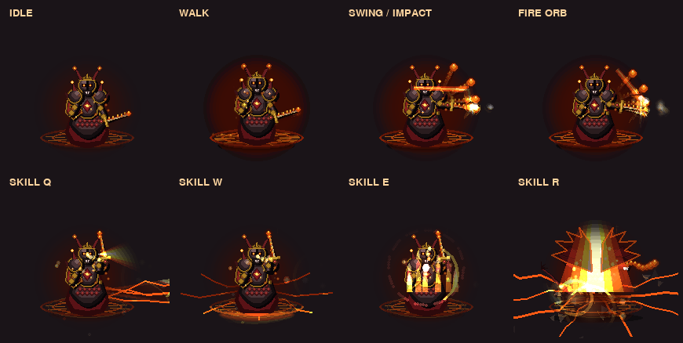
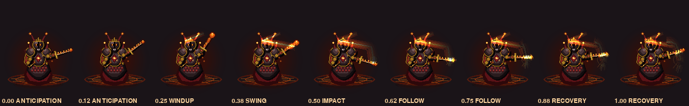

# Ignis Drachorn — V3 Combat FX & Renderer

Rewrite penuh sistem visual + gameplay untuk karakter `ignis_drachorn`
(boss asli level 4 sekaligus hero yang bisa dibuka). Semuanya prosedural:
tidak ada sprite-sheet, tekstur, atau aset eksternal apa pun.




---

## 1. Peta file

| File | Peran |
| --- | --- |
| `bosses/level4.py` → `_NS_ignis_drachorn` | Renderer body (layered), animation controller, pose, debug overlay |
| `heroes/ignis_drachorn_fx.py` | Live FX layer: partikel, proyektil, trail, impact, skill FX, director |
| `heroes/__init__.py` | Registrasi hero-lane (`_LIVE_FX_HEROES` / `_LIVE_FX_PATHS`) |
| `bosses/base_boss.py` | Hook notifikasi impact melee / proyektil / skill |
| `tools/test_ignis_drachorn_v3_combat.py` | 17 test kontrak |
| `tools/_shot_ignis_drachorn_v3.py` | Generator gambar preview |

Arsitektur mengikuti pola yang sudah ada di proyek (lihat
`docs/GORNAK_V3_COMBAT_FX.md`): renderer body hidup di bundle boss,
FX layar hidup di modul `heroes/*_fx.py` dan dipanggil lewat dua hook
`draw_ground_layer` (di bawah sprite) dan `draw_live_layer` (di atas sprite).

---

## 2. Urutan layer

`_NS_ignis_drachorn.draw_ignis` menggambar dengan urutan tetap:

```
1  animation controller  (_update_ignis_anim)
2  ground live FX        (live.draw_ground_layer)
3  shadow / fire aura / ground embers
4  skill ground          (hanya bila FX layer TIDAK memiliki unit ini)
5  BODY: back limb -> lower body -> torso -> cape -> pauldrons -> shield
       -> head -> weapon -> front limb -> highlights
6  attack FX kanvas + proyektil kanvas (fallback, bila tidak owned)
7  live FX depan         (live.draw_live_layer)
8  debug overlay         (DEBUG_CHARACTER)
```

Saat `hurt_flash_timer > 0`, body digambar ke `_flash_buf` lalu di-blit
sebagai mask aditif — jadi flash hanya mengenai siluet, bukan kotak.

**Anti-duplikasi.** Bila modul FX memiliki unit (`owns(boss)` → True),
renderer mematikan skill/proyektil kanvasnya dan menyetel
`_ign_suppress_canvas_projectile = True`. Bila modul FX gagal di-import,
renderer tetap jalan sendiri dengan versi kanvas. Tidak pernah dobel.

---

## 3. Animation controller

`_update_ignis_anim(boss, moving)` — berbasis **delta time** (bukan
hitungan frame), jadi kecepatan animasi sama di 30 fps maupun 144 fps.

State (`ANIM_STATES`, angka = prioritas):

```
IDLE 0 · WALK 10 · RUN 15 · CHARGE 30 · CAST 35 · ATTACK 40
SWING 45 · SKILL 50 · SPECIAL 55 · HIT 60 · HURT 65 · DEATH 100
```

State bernilai lebih tinggi menang; transisi dicatat lewat
`_ign_state_prev` dan `_ign_state_time` sehingga blending/anticipation
bisa dibaca oleh layer FX.

Fase serangan (`ATTACK_PHASES`, progres 0..1):

| Fase | Sampai | Arti |
| --- | --- | --- |
| ANTICIPATION | 0.14 | tarik badan ke belakang |
| WINDUP | 0.30 | angkat pedang |
| SWING | 0.48 | ayunan cepat |
| IMPACT | 0.60 | frame benturan |
| FOLLOW | 0.80 | lanjutan ayun |
| RECOVERY | 1.00 | kembali ke idle |

`ATTACK_ACTIVE_WINDOW = (0.36, 0.60)` adalah **hit window** — hanya di
rentang ini serangan boleh mengenai. `ATTACK_IMPACT_FRAME = 0.48`.

Atribut yang di-set: `_ign_dt`, `_ign_attack_active/_frame/_progress/_raw/_phase`,
`_ign_hit_active`, `_ign_impact_frame`, `_ign_hurt_frames`,
`_ign_state/_state_prev/_state_time`. `_ign_attack_manual` memungkinkan
test/probe mengunci progres secara manual.

---

## 4. Ayunan berbasis arc

Tabel arc dipakai **identik** di dua tempat (`_ARC_FALLBACK` di FX dan
`SWORD_ARC` di renderer) supaya trail dan pedang tidak pernah lepas sinkron.
`theta` dalam radian dari sumbu vertikal, positif = arah hadap.

| Dari | Sampai | θ awal | θ akhir | Easing |
| --- | --- | --- | --- | --- |
| 0.00 | 0.14 | 0.38 | 0.05 | out-quad |
| 0.14 | 0.30 | 0.05 | −1.42 | smoothstep |
| 0.30 | 0.48 | −1.42 | 1.58 | out-cubic |
| 0.48 | 0.60 | 1.58 | 1.58 | hold `sin(pi·t)` |
| 0.60 | 0.80 | 1.58 | 0.72 | smoothstep |
| 0.80 | 1.00 | 0.72 | 0.38 | smoothstep |

`sword_arc(p)` → `(theta, lift)`; `sword_points(boss, x, y)` →
`(grip, tip)`. `SwingTrail` menyimpan `TRAIL_SAMPLES = 18` sampel posisi
tip dan menggambar pita menyempit dari sampel tersebut.

---

## 5. Sistem proyektil

Modular, dua tipe, kontrak atribut sama:
`x, y, velocity, speed, damage, lifetime, target, radius, rotation,
trail, particles, active`.

* `FireOrbProjectile` — serangan jarak jauh dasar, `ORB_SPEED = 690`.
* `MeteorProjectile` — dipakai skill R, `METEOR_SPEED = 900`, `METEOR_COUNT = 5`.

Lifecycle: `SPAWN → TRAVEL → TRAIL → HIT → IMPACT FX → DESTROY`.
`ProjectileSystem` menjaga cap keras `MAX_PROJECTILES = 20`; spawn
melebihi cap mendaur ulang slot tertua, list tidak pernah tumbuh.

Orb dilepas pada jendela `(IMPACT − 0.10, IMPACT − 0.02)` — lewat
`notify_projectile_cast` bila owned, atau `_spawn_fire_projectile` bila tidak.

---

## 6. Skill FX

`SKILL_DUR` (frame): Q 45 · W 40 · E 60 · R 90.
`WORLD_RADIUS`: Q 250 · W 130 · E 105 · R 220. `BREATH_CONE = 0.42`.

| Skill | Nama | Bentuk |
| --- | --- | --- |
| Q | Dragon Breath | cone hangus + semburan api berlapis + retakan magma |
| W | Dragon Tail | sabit sapuan 360° + cincin retak elips + debu |
| E | Dragon Blood | rune naga berputar + pilar darah/api |
| R | Elder Dragon Form | kawah magma, sayap, meteor |

Setiap `SkillFX` melewati fase `CAST → CHARGE → RELEASE → AREA → IMPACT
→ FADE`, punya `draw_ground` dan `draw_front` terpisah, dan otomatis
`done` di akhir umurnya. Cast/impact di-dedup supaya satu skill tidak
memicu dua instance.

---

## 7. Partikel, impact, screen shake, hit stop

* `ParticleSystem` — pool reusable, cap `MAX_PARTICLES = 210`, tidak
  pernah realokasi. Shape: `ember, debris, shard, streak, flame, dust,
  smoke, spark, ring`. Tiap partikel punya pos/vel/acc/rotasi/drag/
  gravity/fade/layer(`back`|`front`)/additive.
* `ImpactFX` — flash inti, dua cincin shockwave, fragmen sabit searah
  benturan, lidah api pecahan. Cap `MAX_IMPACTS = 9`.
* Screen shake & hit stop dikelola `IgnisFXDirector` dan disalurkan lewat
  `heroes/combat_feel.py` (bus bersama), jadi tidak bentrok dengan hero lain.

---

## 8. Catatan blending (penting)

Dua jebakan pygame yang menyebabkan "blok warna nyasar" dan sudah
diperbaiki di modul ini — jangan diulang:

1. **`pygame.draw.*` menimpa, bukan mem-blend.** Pada Surface `SRCALPHA`,
   menggambar warna ber-alpha langsung akan *mengganti* kanal alpha
   tujuan, sehingga poligon api tampil sebagai blok solid. Gunakan
   helper `_blend_polygon`, `_blend_line`, `_blend_circle` yang
   menggambar ke scratch opaque lalu mem-blit dengan alpha/aditif.
2. **`BLEND_RGB_ADD` mengabaikan per-pixel alpha.** Pixel "transparan
   tapi berwarna" (sisa gradien) tetap dijumlahkan, membuat seluruh
   kotak surface terlihat. `_blit_faded` karena itu memakai
   `_premultiplied()` (cache lewat `WeakKeyDictionary`) sebelum blit
   aditif, dan menskalakan RGB manual karena `set_alpha` juga diabaikan
   oleh mode aditif.

Scratch surface di-cache per ukuran **persis** `(w, h, depth % 4)` —
pembulatan ukuran dilarang, karena blit surface yang dibulatkan ke atas
ikut menyalin margin basi.

---

## 9. Performa

* Semua bentuk statis di-cache: `glow_surface, ember_surface,
  spark_surface, ring_surface, ellipse_ring_surface, ground_glow_surface,
  rune_surface`. `clear_cache()` / `cache_size()` untuk inspeksi.
* Renderer meng-cache `_shadow_cache` dan `_aura_cache`, memakai satu
  `_flash_buf` yang dipakai ulang.
* Budget adaptif: `particle_budget()`, `glow_allowed()`, `shake_allowed()`
  menurunkan detail otomatis pada perangkat lambat.
* FX digambar pada skala 1.0 lewat hook layar, karena sprite hero
  di-cache/di-quantize/di-smoothscale (~0.69) — menggambar FX ke dalam
  sprite cache akan membekukannya.

---

## 10. Debug

Set `DEBUG_CHARACTER = True` di `heroes/ignis_drachorn_fx.py` **atau**
`_NS_ignis_drachorn.DEBUG_CHARACTER = True`. Overlay menampilkan
bounding box, titik pivot, busur ayunan + hit window aktif, posisi
proyektil, dan jumlah partikel/proyektil/skill hidup. Default `False`.

---

## 11. Kompatibilitas

API lama tetap hidup: `draw_ignis_drachorn`, `draw_ignis`, `draw_boss`,
`_update_attack_anim`, `_spawn_fire_projectile`, `_manage_projectiles`,
serta field `_ign_last_x/_last_y`, `_ign_attack_active/_frame/_progress`,
`_ign_prev_timer`, `_ign_projectiles`, `_ign_proj_spawned`.
Nama list proyektil sengaja diakhiri `_projectiles` agar
`_park_renderer_fx` di `heroes/__init__.py` mengosongkannya saat render cache.

---

## 12. Test

```bash
SDL_VIDEODRIVER=dummy SDL_AUDIODRIVER=dummy python3 tools/test_ignis_drachorn_v3_combat.py
```

17 test: API modul, kontrak palette, animation controller, sword arc,
lifecycle proyektil, cap proyektil, lifecycle+dedup skill, renderer +
live layer bersamaan, semua state render, debug overlay, jalur hero-lane,
integrasi `base_boss`, registry, AI q/w/e/r, prosedural murni,
FX terbatas + reset bersih, cache surface terbatas.

Regresi yang ikut dijalankan dan lulus: `test_zharok_masterwork`,
`test_varkul_v3_combat`, `test_true_boss_spawn`, `test_spritecache`,
`test_renderer_projectiles_not_baked`, `test_swing_anim`.
