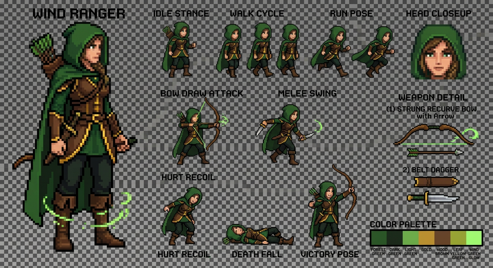

# Sylara v1 — Godot 4.x Character (Sprite-Based Animation + Skill FX)



Dokumen ini mendeskripsikan implementasi karakter **Sylara** untuk
Godot 4.x menggunakan **AI-generated sprite assets** + **VFXManager**
untuk skill effects.

* Karakter: `CHARACTER_NAME = "sylara"` (Wind Ranger — recurve bow,
  daun, angin laminar).
* Referensi kualitas: Wind Ranger Dota 2 (silhouette, polish, combat
  feel) — TIDAK menyalin desain.
* **Sprite-based animation**: AI-generated sprite strips (10 animations)
* **Procedural VFX**: Skill effects via VFXManager pooled system
* Target platform: **Android** (Mobile renderer)

---

## 1. Architecture

```
sylara/
├── SylaraSkeleton.tscn   — scene tree (root + AnimatedSprite2D + SkillFX)
├── SylaraSkeleton.gd     — root controller (state machine, drive API, signals)
├── SylaraSpriteSetup.gd  — SpriteFrames configuration from strips
└── SylaraSkillFX.gd      — sequencer FX skill via VFXManager pooled
```

**Asset files:**
```
godot/assets/units/
├── sylara_idle_strip.png      — 8 frames @ 8 FPS
├── sylara_walk_strip.png      — 8 frames @ 10 FPS
├── sylara_run_strip.png       — 8 frames @ 12 FPS
├── sylara_attack_strip.png    — 8 frames @ 15 FPS
├── sylara_swing_strip.png     — 6 frames @ 12 FPS
├── sylara_skill_q_strip.png   — 10 frames @ 15 FPS (Focus Fire)
├── sylara_skill_w_strip.png   — 8 frames @ 10 FPS (Windrun)
├── sylara_skill_e_strip.png   — 8 frames @ 12 FPS (Shackle Shot)
├── sylara_skill_r_strip.png   — 12 frames @ 12 FPS (Powershot)
└── sylara_hurt_strip.png      — 4 frames @ 10 FPS
```

---

## 2. Visual Identity

**Color Palette:**
- Forest green `#376234` — tunic, hood, cape
- Dark green `#1e3a1c` — shadows
- Gold `#aa8228` — trim, buckles, accents
- Wood brown `#825a32` — bow
- Wind green `#6ec35a` — magic effects, skill VFX

**Character Design:**
- Strong silhouette: hood + flowing cape + recurve bow + quiver
- Leather armor vest with gold trim over green tunic
- Recurve bow as primary weapon
- Green eyes visible under hood shadow

---

## 3. Animation System

### State Machine

```
SylaraSkeleton.drive()
    ↓
_derive_state(action, moving, skill)
    ↓
_play_animation(state)
    ↓
AnimatedSprite2D.play(animation_name)
```

### Animation States

| State | Animation | Frames | FPS | Loop | Trigger |
|-------|-----------|--------|-----|------|---------|
| idle | `idle` | 8 | 8 | ✓ | Default state |
| walk | `walk` | 8 | 10 | ✓ | Moving, speed ≤ 220 |
| run | `run` | 8 | 12 | ✓ | Moving, speed > 220 |
| attack | `attack` | 8 | 15 | ✗ | Ranged attack (distance ≥ 64) |
| swing | `swing` | 6 | 12 | ✗ | Melee attack (distance < 64) |
| skill_q | `skill_q` | 10 | 15 | ✗ | Focus Fire cast |
| skill_w | `skill_w` | 8 | 10 | ✗ | Windrun cast |
| skill_e | `skill_e` | 8 | 12 | ✗ | Shackle Shot cast |
| skill_r | `skill_r` | 12 | 12 | ✗ | Powershot cast |
| hurt | `hurt` | 4 | 10 | ✗ | HP decrease detected |
| death | (fallback: idle) | — | — | — | Pending sprite strip |
| victory | (fallback: idle) | — | — | — | Pending sprite strip |

### State Priority

```
override (play()) > skill > attack/swing > hurt > death > run > walk > idle
```

---

## 4. Skill Visual Effects

Skill VFX handled by **SylaraSkillFX.gd** using **VFXManager** pooled actors:

### Q — Focus Fire (Rapid Volley)
- 5 arrow streaks from bow to target
- Impact flashes at target location
- Green wind particles
- Duration: ~0.6s

### W — Windrun (Speed Aura)
- Circular wind burst around character
- Expanding wind ring
- Leaf particles orbiting
- Speed buff visual indicator
- Duration: 5s (buff) + 0.5s (cast VFX)

### E — Shackle Shot (Vine Projectile)
- Green vine projectile from bow
- Vine trail effect
- Impact: vine wrap animation at target
- Duration: ~0.8s (flight) + 0.5s (impact)

### R — Powershot (Charged Gale)
- Charge phase: wind gathering at bow
- Release: massive wind projectile
- Screen shake + hitstop on impact
- Large explosion VFX
- Duration: ~1.0s (charge) + 0.8s (flight) + 0.5s (impact)

---

## 5. Integration

### RendererRegistry

```gdscript
# godot/scripts/render/RendererRegistry.gd
const HERO_SCENES = {
    "kaizen": preload("res://scenes/hero/kaizen/KaizenSkeleton.tscn"),
    "sylara": preload("res://scenes/hero/sylara/SylaraSkeleton.tscn"),
}
```

### Hero.gd Compatibility

SylaraSkeleton implements the same interface as KaizenSkeleton:

```gdscript
func drive(phase, action, attack_progress, facing, is_moving, skill, delta):
    # Update sprite animation based on state
    pass

func handles_skill_fx(skill_key):
    return true  # SylaraSkillFX handles all skill VFX
```

---

## 6. Performance

### Memory
- 10 sprite strips × ~2MB each = ~20MB total
- SpriteFrames created once at `_ready()`
- No runtime texture loading

### Rendering
- AnimatedSprite2D: single draw call per frame
- VFXManager: pooled actors (no allocation during gameplay)
- Target: 60 FPS on mid-range Android devices

### Optimization Notes
- Sprite strips could be packed into texture atlas for better memory efficiency
- Consider texture compression (ETC2/ASTC) for mobile
- VFX actors reused from pool (32 max)

---

## 7. Pending Work

### Missing Sprites
- [ ] `sylara_death_strip.png` — death animation (8 frames)
- [ ] `sylara_victory_strip.png` — victory celebration (6 frames)

Currently falls back to idle animation.

### Future Improvements
- [ ] Texture atlas packing for all sprite strips
- [ ] Normal maps for lighting effects
- [ ] Additional idle variations (breathing, looking around)
- [ ] Combo attack sequences
- [ ] Critical hit animations

---

## 8. Files Reference

### Core Scripts
- `godot/scenes/hero/sylara/SylaraSkeleton.gd` — Root controller
- `godot/scenes/hero/sylara/SylaraSpriteSetup.gd` — SpriteFrames config
- `godot/scenes/hero/sylara/SylaraSkillFX.gd` — Skill VFX sequencer
- `godot/scenes/hero/sylara/SylaraSkeleton.tscn` — Scene tree

### Assets
- `godot/assets/units/sylara_*_strip.png` — Sprite strips (10 files)

### Integration
- `godot/scripts/render/RendererRegistry.gd` — Registers Sylara scene

### Documentation
- `docs/SYLARA_GODOT_REBUILD.md` — This file
- `docs/sylara_preview_*.png` — Concept art references

---

## 9. Development Notes

### Sprite Generation
Sprites generated via AI image generation with consistent prompts:
- Pixel art style
- 64x80 pixels per frame
- Transparent background
- Side view facing right
- Consistent character design across all animations

### Animation Timing
FPS values tuned for game feel:
- **Idle/Walk**: Slow, relaxed (8-10 FPS)
- **Run**: Faster, energetic (12 FPS)
- **Attack/Skills**: Quick, snappy (12-15 FPS)
- **Hurt**: Brief, reactive (10 FPS)

### State Machine Design
Priority-based state selection ensures:
- Skills interrupt movement/attacks
- Attacks interrupt movement
- Hurt can interrupt anything (via override)
- Smooth transitions between states
