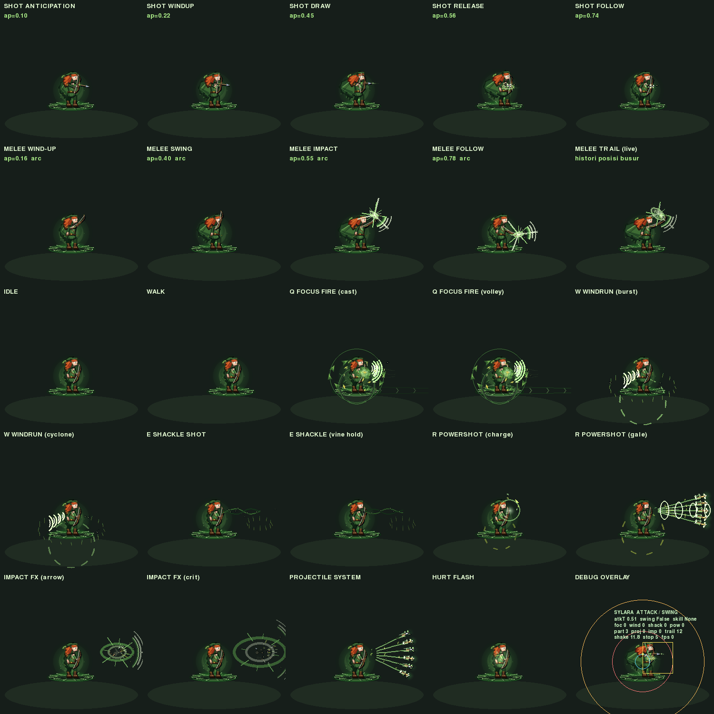

# Sylara v3 — Combat FX & Game Feel (lapisan hidup 100% prosedural)



Dokumen ini melanjutkan `docs/SYLARA_V2_RENDERER.md` (rig, palette, pose,
skill body).  Semua nama publik v2 tetap hidup — v3 **menambah** lapisan
tempur, bukan mengganti arsitektur.

* Karakter: `CHARACTER_NAME = "sylara"` (Wind Ranger — busur recurve,
  daun, angin laminar).
* Tanpa aset eksternal: tidak ada PNG/JPG/GIF, sprite-sheet, atau
  `pygame.image.load`.  Semua bentuk dibuat dengan `pygame.Surface`,
  `pygame.draw`, `pygame.transform`, dan `pygame.Vector2`.
* Modul baru: [`heroes/sylara_fx.py`](../heroes/sylara_fx.py).
* Regresi: [`tools/test_sylara_v3_combat_fx.py`](../tools/test_sylara_v3_combat_fx.py)
  (76 tes) + preview [`tools/_shot_sylara_v3_fx.py`](../tools/_shot_sylara_v3_fx.py).

---

## 1. Masalah yang sebenarnya

Badan Sylara digambar `_NS_sylara.draw_sylara()` ke sebuah **canvas yang
di-cache** oleh `heroes/__init__.py`, lalu di-scale (~0.62x) saat di-blit
ke arena.  Konsekuensinya:

1. **Efek ikut beku.**  `_hero_cache_key` mengkuantisasi timer serangan
   tiap 2 frame; apa pun yang digambar di canvas hanya berubah sekali
   per 2 frame dan dipakai ulang oleh semua unit dengan key sama.  Trail
   ayunan, partikel, dan proyektil jadi patah-patah.
2. **Efek ikut menyusut.**  Cincin 180 px dunia digambar di canvas lalu
   dikecilkan jadi ~112 px — telegraph kehilangan makna gameplay.
3. **Efek terpotong.**  Canvas 240x210; apa pun yang keluar dari kotak
   itu hilang, padahal panah harus terbang 300+ px.
4. **Tidak ada delta-time.**  Pose canvas mengikuti timer frame gameplay,
   sedangkan game feel (trail, hit-stop, shake) butuh waktu nyata.

Karena itu v3 tidak "menambah gambar di canvas", tapi memindahkan semua
yang harus hidup ke **lapisan layar 1:1**.

---

## 2. Pemecahan: pisahkan badan dari efek

| RENDERER (canvas, ter-cache)                | `sylara_fx` (layar, hidup, dt nyata)      |
|---------------------------------------------|-------------------------------------------|
| rig, selout, hood, cape, quiver              | pita sapuan busur dari histori posisi      |
| bayangan kontak, platform angin              | partikel daun/bulu/gust/debu/serpihan      |
| telegraph AOE Q/W/E/R besar (world-space)    | proyektil panah angin (sistem penuh)       |
| pose tarik tali & pose sapuan melee          | impact FX + flash + hit-stop + shake       |
| napas, kedip, kibaran rambut                 | siklon W, sulur E, gale R, overlay debug   |

Jembatan supresi ganda: renderer memanggil `sylara_fx.attach(hero)` dan
menyetel `_NS_sylara._FX_LIVE.v`.  Selama flag itu `True`, renderer
**melewati** trail sapuan di-canvas.  Kalau modul FX tidak ada (portrait
HD, tooling, unit test), flag `False` dan fallback canvas lama tetap
berjalan — tidak ada visual yang hilang.

---

## 3. Animation controller (`SylaraFXDirector`)

State + prioritas (`ANIM_PRIORITY`):

```
IDLE 0 · WALK 10 · RUN 15 · CHARGE 30 · CAST 35 · ATTACK 40 · SWING 45
SKILL 50 · SPECIAL 55 · HIT 60 · HURT 65 · DEATH 100
```

* Transisi hanya terjadi kalau prioritas baru >= prioritas berjalan,
  atau state berjalan sudah > 0.05 s (mencegah pose kedip-kedip).
* `DEATH` mengunci; revive tidak dipercaya sampai frame berikutnya.
* Timeline serangan diambil dari **`attack_timer` gameplay** (naik saat
  serangan mulai, turun tiap langkah simulasi), bukan dari pose canvas —
  jadi progress tetap 60 Hz walau sprite ter-cache dipakai ulang.
* Enam fase, satu sumber kebenaran di renderer
  (`_resolve_timeline()` menariknya saat import):

```
ANTICIPATION 0.00–0.12 · WINDUP 0.12–0.26 · SWING 0.26–0.58
IMPACT 0.58–0.62 · FOLLOW 0.62–0.80 · RECOVERY 0.80–1.00
frame IMPACT (lepas tali / puncak sapuan) = 0.52
```

Deteksi kejadian sepenuhnya *edge-triggered*: cast skill (dari
`active_skill` **dan** timer gameplay mentah), swing start/end, release
panah, hurt (dari penurunan `hp`), death (dari `alive`).

---

## 4. Dua bentuk serangan, satu timeline

Sylara `range = 130`.  Kalau target lebih dekat dari
`_NS_sylara.SWING_RANGE = 64`, renderer mengunci `_sy_swing_mode = True`
saat serangan dimulai (agar pose tidak berganti di tengah animasi) dan
menyetel `_pose_variant = 1`.

**`_pose_variant` masuk `_hero_cache_key`** — tanpa itu, sapuan melee dan
tembakan akan berbagi entri cache dan pemain melihat sprite basi.

### Sapuan berbasis busur (bukan lerp A→B)

`_NS_sylara._swing_arc_pose(ap)` memutar limb busur mengelilingi pivot
bahu:

* sudut: `SWING_ARC_START -1.24` → `MID -0.26` → `END +0.86` rad, dengan
  *ease-in* pada wind-up dan *ease-out* + overshoot pada follow-through
  (kecepatan sudut berubah — inilah yang membedakannya dari lerp linear);
* radius pivot memanjang saat menghantam
  (`REST 19 → WINDUP 14 → STRIKE 29 → FOLLOW 24`) sehingga ada bobot;
* hitbox aktif `ATTACK_ACTIVE_WINDOW = (0.42, 0.62)`
  (`_NS_sylara._swing_hitbox` mengembalikan `None` di luar jendela);
* damage **tidak** berubah: sapuan adalah riposte visual, damage tetap
  mengalir lewat jalur ranged yang sudah ada.

### Weapon trail dari histori posisi

`SwingTrail` menyimpan `TRAIL_SAMPLES = 12` pasangan (pangkal, ujung)
posisi **nyata** limb busur di layar (`bow_points()` → `_bow_geometry()`
→ `RIG_SCALE x _render_scale`), lalu menyusunnya jadi 5 lapis:
selubung angin gelap → badan pita → inti nyaris putih → garis ujung
1–2 px (hard edge pixel-art) → kilau daun.  Karena bentuknya murni
turunan lintasan, trail otomatis benar untuk arah hadap mana pun.

---

## 5. Projectile — panah angin (`SylaraProjectile`)

Lifecycle penuh: `SPAWN → TRAVEL → TRAIL → HIT → IMPACT FX → DESTROY`.

Atribut kontrak: `position, velocity, speed, damage, lifetime, target,
radius, rotation, trail, particles, active` (+ `homing`, `on_hit`,
`state`, `kind`).

* Jenis: `arrow` (dasar), `gale` (Powershot/Focus Fire), `vine`
  (Shackle).
* Bukan lingkaran: `draw_wind_arrow()` menyusun halo additive → ekor pita
  angin menyempit → batang kayu 2 nilai → mata baja bersudut dengan
  kilau 1 px → fletching hijau → daun orbit.  Ujung mata panah TEPAT di
  titik posisi, jadi benturan terasa pas.
* Homing lembut ke target hidup; tumbukan `radius + target.radius`.
* Fase `IMPACT` 0.16 s dulu (percikan + trail memudar) baru `DESTROY` —
  proyektil tidak pernah "hilang begitu saja".
* Cap keras `MAX_PROJECTILES = 16` per unit.

---

## 6. Skill FX (lifecycle `cast → charge → release → area → after → fade`)

| Skill | Gameplay (`hero_skills/_bundle.py`) | Lapisan hidup |
|-------|--------------------------------------|----------------|
| Q Focus Fire | 180 f, cd÷1.7, pierce | kipas pita angin dari nock, daun tersedot, koridor volley + chevron berjalan di tanah |
| W Windrun | 180 f, speed x2, heal 30 | ledakan daun melingkar, halo rumput r=70 dunia, siklon daun mengencang, lembar angin dash |
| E Shackle Shot | 150 f, stun 45, range 200 | dua untai sulur berkelok dari busur ke target + daun merambat, halo rumput di kaki target, impact `vine` |
| R Powershot | 60 f charge → 5 panah, cone 30°, range 300 | cincin tekanan mengecil + inti memutih, lalu **RELEASE**: 5 proyektil `gale`, gale tunnel, shake 9.0, hit-stop 0.062 s |

Semua radius dinyatakan di **ruang dunia** (`WORLD_RADIUS`), digambar di
layar 1:1 — jadi telegraph selalu sebesar area gameplay sebenarnya.

Pagar anti-beku: kalau hero tewas di tengah skill, `Hero.update` berhenti
dan timer gameplay membeku > 0.  `_guard_stuck()` mematikan FX skill
setelah 15 s atau segera saat `alive == False`, sehingga tidak ada efek
abadi menempel di mayat.

---

## 7. Impact system + game feel

`ImpactFX(kind=arrow|gale|vine|swing|crit)`, maksimum 8 per unit:

1. **flash** flare bintang 6 sudut (bukan bola) + glow additive,
2. **shockwave** cincin **elips berarah** (dua lapis),
3. **spoke debris** garis radial memanjang,
4. **sabit angin** busur mengembang + 3 fragmen + chevron arah
   (crit: silang emas),
5. bahasa khusus: sulur mengerat (`vine`), koridor gale (`gale`),
6. **daun terlempar** — tanda tangan Sylara.

Game feel lewat bus bersama `heroes/combat_feel.py`:

* `hit_stop(0.034 + 0.02*power (+0.014 crit))` — selalu dijepit ke
  **0.03–0.08 s** (maks 5 langkah fixed 60 Hz);
* `shake(strength, duration)` dengan `shake_strength` / `shake_duration`
  yang **meluruh bertahap** (amount ∝ sisa durasi);
* saat hit-stop aktif, waktu FX melambat ke 0.18x (bukan berhenti total),
  jadi percikan tetap terbaca.

---

## 8. Integrasi (file yang berubah)

**FILE 1 → `heroes/sylara_fx.py` (BARU, ~3.470 baris)**
Seluruh lapisan hidup: `SYLARA_PALETTE`, surface cache (glow/leaf/
feather/arrowhead/ring/ellipse-ring/ground-glow/gust/chevron/dashed-ring/
grass-halo) + `rotated_cached` kuantisasi 15°, `Particle` (10 bentuk) &
`ParticleSystem` (`burst/stream/ring`, cap 165, pool dipakai ulang),
`SwingTrail`, `ImpactFX`, `SylaraProjectile` + `ProjectileSystem`,
`draw_wind_arrow`, `SkillFX` Q/W/E/R, game feel, `ANIM_PRIORITY` +
`ATTACK_PHASES` + `attack_phase()` + `_resolve_timeline()`, jembatan
geometri (`render_scale`, `bow_points`, `swing_hitbox`),
`SylaraFXDirector`, `draw_debug_overlay`, dan API modul
(`director_for/attach/owns/_advance/tick/reset_all/total_particles/
total_projectiles/draw_ground_layer/draw_live_layer/notify_*`).

**FILE 2 → `heroes/_bundle.py` (`_NS_sylara`)**
1. jembatan FX hidup: `_LiveFlag`, `_FX_LIVE`, `_live_module()`,
   `_fx_live_owned()`, `live_fx_ready()`;
2. konstanta v3 timeline + sapuan (`ATTACK_ANTICIPATION_END`,
   `ATTACK_SWING_END`, `ATTACK_IMPACT_END`, `ATTACK_FOLLOW_END`,
   `ATTACK_ACTIVE_WINDOW`, `ATTACK_IMPACT_FRAME`, `SWING_WINDOW`,
   `SWING_RANGE`, `SHOULDER_PIVOT`, `SWING_ARC_*`, `SWING_R_*`,
   `ANIM_STATES`, `DEBUG_CHARACTER`);
3. easing + `_swing_arc_pose()` (6 fase, overshoot);
4. pose busur terpusat `_bow_pose_local()` / `_bow_geometry()` +
   `_bow_grip_local/_bow_tip_local/_bow_nock_local/_bow_release_local/
   _bow_trail_samples`, dipakai bersama rig, trail, dan FX;
5. `_draw_bow_swing_trail()` (fallback canvas), `_resolve_anim_state()`,
   `_swing_hitbox()`, `_draw_debug()`;
6. `_update_attack_anim()`: `_sy_attack_phase`, `_sy_hit_active`,
   `_sy_swing_mode` (dikunci saat trigger, set `_pose_variant`),
   `_sy_hurt_frames`, state machine `_sy_state/_sy_state_prev/
   _sy_state_time`;
7. `draw_sylara()`: `attach` / `draw_ground_layer` sebelum badan,
   `_FX_LIVE` di-set, `draw_live_layer` + `_draw_debug` di ekor;
8. `_draw_sylara_attack()` / `_draw_sylara_rig()`: pose sapuan melee,
   tidak melepas panah renderer di mode sapuan, trail canvas hanya kalau
   lapisan hidup tidak aktif.

**FILE 3 → `heroes/__init__.py`**
`"sylara"` masuk `_LIVE_FX_HEROES` + `_LIVE_FX_PATHS`
(`heroes.sylara_fx`), dan `_hero_cache_key` kini menyertakan
`_pose_variant` pada cabang serangan (generik untuk semua hero).

**FILE 4 → `_entity.py`**
Dua hook baru (dibungkus `try/except`, difilter `hero_type`):
`sylara_fx.notify_projectile_impact` pada pendaratan proyektil, dan
`sylara_fx.notify_melee_impact` pada benturan melee.  Alur damage tidak
disentuh.

**FILE 5 → `_core.py`**
`"sylara_fx"` masuk daftar modul penghitung partikel di HUD debug
(angka ini harus selalu kembali ke 0 setelah pertarungan).

**FILE 6 → `tools/test_sylara_v3_combat_fx.py` (BARU)** — 76 tes regresi.

**FILE 7 → `tools/_shot_sylara_v3_fx.py` (BARU)** — pembuat lembar
preview `docs/sylara_v3_combat_fx.png`.

**FILE 8 → `docs/SYLARA_V3_COMBAT_FX.md` (BARU)** — dokumen ini.

### Catatan performa — `_advance()` bukan `tick()`

`draw_ground_layer` memanggil `_advance(director)` yang memakai stempel
milidetik **per director**.  Kalau memanggil `tick()` (yang memajukan
SEMUA director), 8 Sylara di layar berarti 8x8 = 64 pembaruan per frame
(O(n²)).  Dengan `_advance`, tiap unit maju tepat sekali per frame gambar
(O(n)) dan unit di luar layar tidak memakan waktu sama sekali.
`tick()` tetap tersedia untuk pemanggil global dan aman dipanggil
berkali-kali dalam satu frame (dijaga stempel milidetik).

---

## 9. Verifikasi

```bash
SDL_VIDEODRIVER=dummy python3 -m pytest tools/test_sylara_v3_combat_fx.py -q
SDL_VIDEODRIVER=dummy python3 tools/test_sylara_masterwork.py
SDL_VIDEODRIVER=dummy python3 tools/_audit_sylara_v2.py
SDL_VIDEODRIVER=dummy python3 tools/test_codebase_heroes.py
SDL_VIDEODRIVER=dummy python3 tools/test_swing_anim.py
SDL_VIDEODRIVER=dummy python3 tools/_shot_sylara_v3_fx.py   # preview PNG
```

Yang dikunci tes: tanpa aset eksternal · palet 9 kunci + sinkron dengan
renderer · API publik lama utuh · urutan 6 fase & sinkron konstanta
renderer · progress 60 Hz monoton · prioritas state + kunci DEATH ·
ayunan busur (varian kecepatan sudut > 0.05 rad) · trail menempel di limb
· hitbox di depan karakter · cap/pool/peluruhan partikel · lifecycle
projectile & homing · lifecycle 6 fase skill + pembersihan timer macet ·
hit-stop 0.03–0.08 s · shake meluruh · supresi ganda trail · overlay
debug · < 2.5 ms per unit untuk 8 unit bertempur · **tidak ada efek
abadi** setelah pertarungan.

---

## 10. Debug

```python
import heroes.sylara_fx as F
F.DEBUG_CHARACTER = True     # overlay lapisan hidup
```

Menampilkan: hurtbox, attack range (130) + jangkauan sapuan (64), hitbox
sapuan saat jendela aktif, radius AOE skill aktif, garis sulur E, anchor
limb busur + nock, radius tumbukan tiap proyektil, lalu teks state/fase,
`attack_t`, mode sapuan, timer Q/W/E/R, jumlah partikel/proyektil/impact/
sample trail, kekuatan shake, sisa frame hit-stop, dan FPS.

`_NS_sylara.DEBUG_CHARACTER = True` menyalakan overlay sisi renderer
(hurtbox rig, progress bar, tick state) untuk membandingkan pose canvas
dengan lapisan hidup.

---

## 11. Palet

`SYLARA_PALETTE` memenuhi kontrak 9 kunci (`outline, shadow, dark, body,
mid, light, highlight, weapon, fx`) lalu diperluas: ramp angin hijau
`fx_deepest…fx_white`, daun `leaf_dark…leaf_pale` + `leaf_ember`, emas
`gold_dark…gold_hot`, kayu busur `wood_dark…wood_shine`, anak panah
(`shaft`, `head`, `feather`, `string`), sulur `vine_*`, dan materi
lingkungan (`dust`, `smoke`).

Saat modul dipakai pertama kali, `_sync_palette()` menyalin warna tema
dari `_NS_sylara.PALETTE` (`wind_*`, `wood_*`, `arrow_*`, `leaf_*`,
`gold_*`) sehingga badan dan efek **tidak pernah** melenceng warnanya:
renderer tetap satu-satunya sumber kebenaran material karakter.
